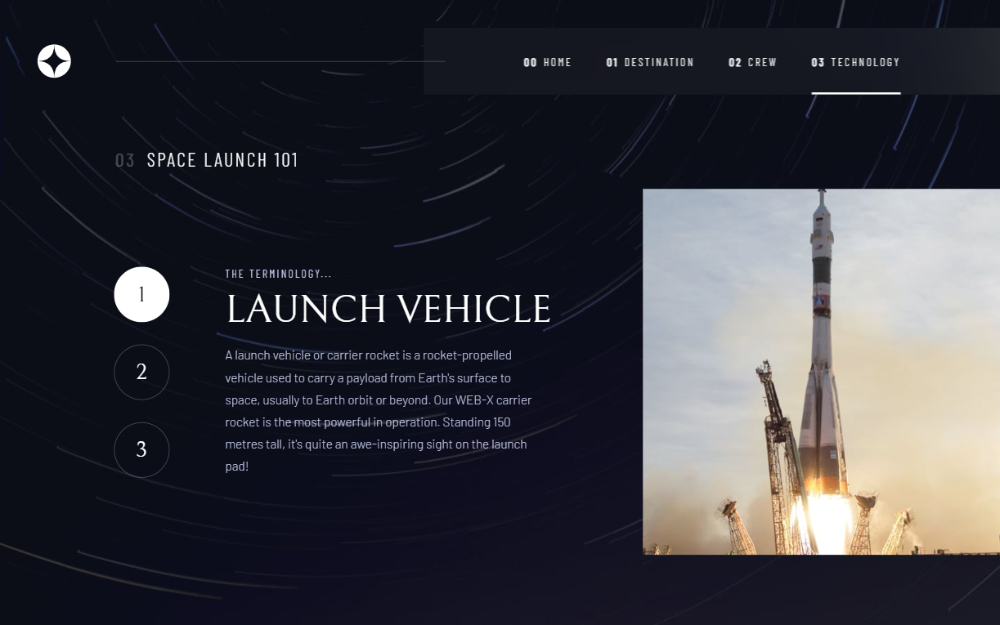
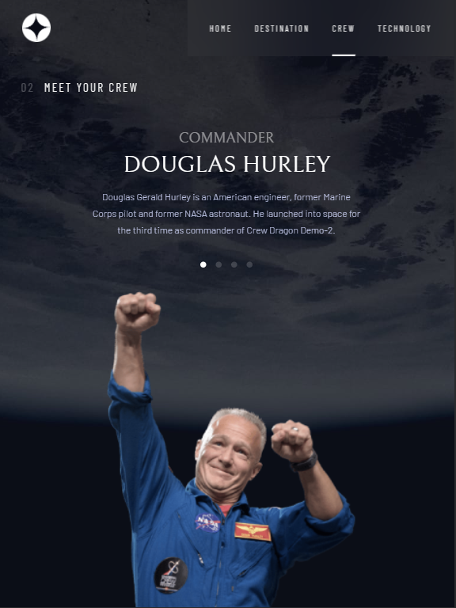
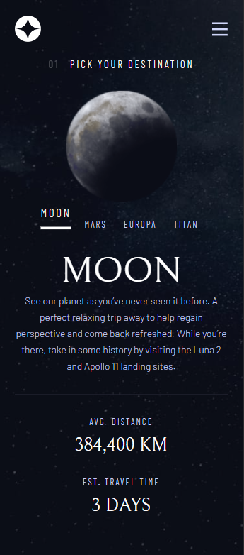
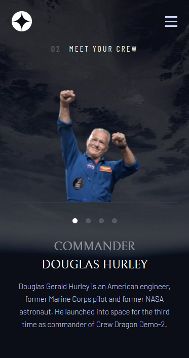

# Project Overview

This is a solution to the [Space tourism website challenge on Frontend Mentor](https://www.frontendmentor.io/challenges/space-tourism-multipage-website-gRWj1URZ3). Frontend Mentor challenges help you improve your coding skills by building realistic projects.

## Table of contents

- [Overview](#overview)
  - [Features](#features)
  - [Screenshots](#screenshots)
  - [Links](#links)
- [My process](#my-process)
  - [Built with](#built-with)
  - [Development Notes](#development-notes)
- [Author](#author)

## Overview

### Features

Users should be able to:

- View the optimal layout for each of the website's pages depending on their device's screen size
- See hover states for all interactive elements on the page
- View each page and be able to toggle between the tabs to see new information

### Screenshots

**_Desktop Layout_** (1440 X 900)\

**_Tablet Layout_** (768 x 1024)\

**_Mobile Layout_** (375 x 667) \

### Links

- Solution URL: [Github Respository](https://github.com/nelsonaq/space-tourism)
- Live Site URL: [Hosted on Netlify](https://space-tourism-nelson.netlify.app/)

## My process

### Built with

- Semantic HTML markup
- CSS custom properties
- Flexbox
- Mobile-first approach
- Plain JavaScript

### Development Notes

- Close the app drawer (_aside from the close icon_) for any touches outside it (_mobile view_)
- Optimized html structure for easier styles implementation for each respective device's screen size
- Appealing UI for the most common device's screen size
- Smooth and elegant animation
- Design accuracy from the given Figma design file while adding personal touch to the project
- Enable animation to be triggered when selecting a different content for each page
- Prevent animation and content changes when attempting to select the already selected content
- Allow the images to be updated first before the animation starts

## Author

- Name: Nelson Aquino
- Website - [Github Profile](https://github.com/nelsonaq)
- Frontend Mentor - [@nelsonaq](https://www.frontendmentor.io/profile/nelsonaq)
- Email - chibuds217@gmail.com
